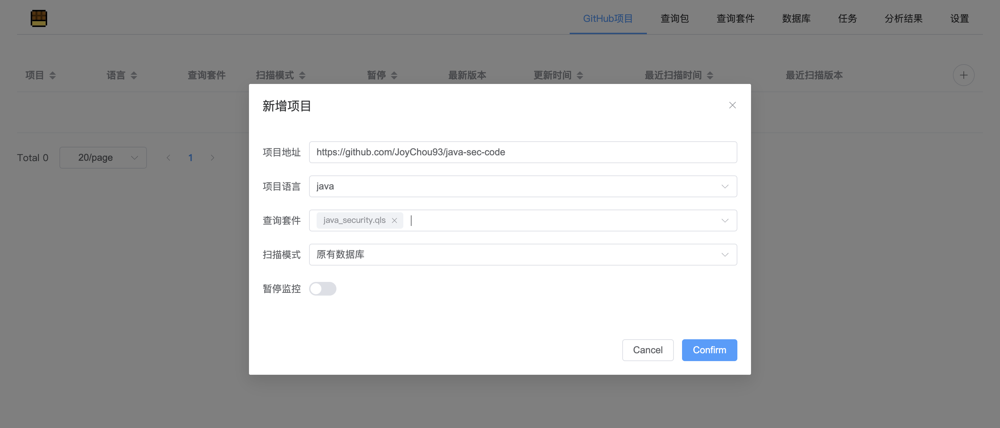
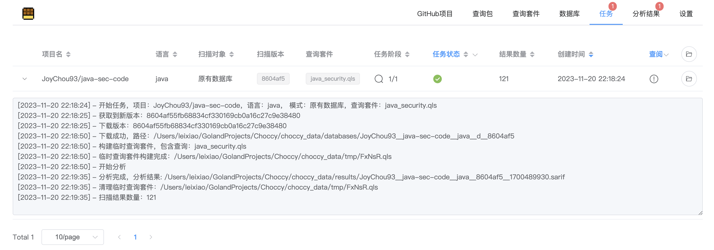
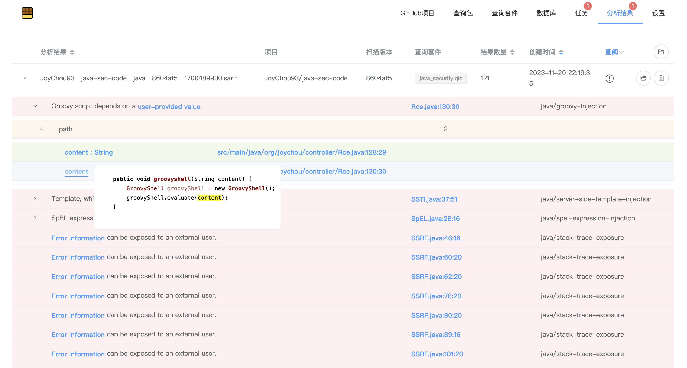
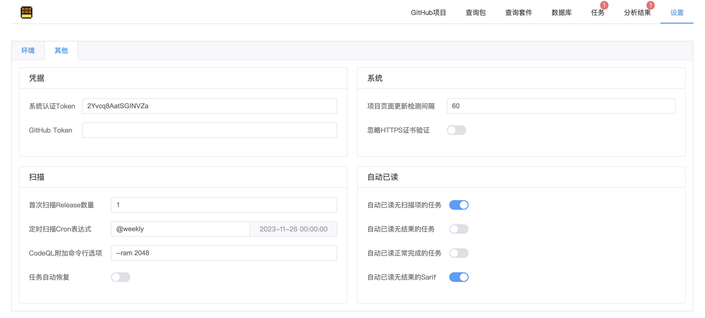

# Choccy


## 介绍
Choccy是一个用于监控GitHub仓库更新并自动对其进行CodeQL分析扫描的项目。


## 编译

需要先进入web目录编译前端，编译golang后端时会自动嵌入前端资源文件。

```shell
cd web
npm install
npm run build
cd ..
go build -o choccy main.go 
```


## 运行

### Docker运行

```shell
docker run \
-e TZ=Asia/Shanghai \
-v ~/choccy_data:/root/choccy_data \
-p 8080:80 \
--name choccy \
-d \
yuyangjia/choccy:1.0 ./choccy
```

查看系统初始Token：

```shell
docker logs choccy
```


在Docker容器中未配置各语言的编译环境，只预置了CodeQL二进制文件和官方库，所以默认只能选择`原有数据库`这个扫描模式。

另外CodeQL对性能有一定要求，配置过低的机器可能会运行非常缓慢或者失败。配置要求参考：https://docs.github.com/zh/code-security/code-scanning/creating-an-advanced-setup-for-code-scanning/recommended-hardware-resources-for-running-codeql


### 二进制文件运行

运行前需要自行配置好代码编译环境，CodeQL环境，并设置环境变量。

主要配置和功能都在Web界面，命令行参数只有两个：

```
-addr string
      监听地址和端口 (default "0.0.0.0:80")
-token string
      系统Token
```

程序第一次运行时如果不指定token将会随机生成并输出到命令行，该项目本身有潜在的任意命令执行和文件读取等功能，所以如果服务开放于公网请务必设置强密码。


## 使用示例

使用前配置好CodeQL环境，最好也在设置中配好GitHub Token，否则可能会被GitHub api限制访问。

目前支持GitHub仓库的Release扫描和原有CodeQL数据库扫描，GitHub会对很多仓库自动编译CodeQL数据库（可以通过接口 `https://api.github.com/repos/<owner>/<repo>/code-scanning/codeql/databases` 查看），这会省去配置本地编译环境的步骤和本地编译数据库的时间，所以扫描模式优先选择原有数据库，以[java-sec-code](https://github.com/JoyChou93/java-sec-code)这个项目为例：



查询套件是一系列查询语句的集合，可以点击菜单栏中的`查询套件`进行查看和编辑，这里可以先选预置的`java_security.qls`。

然后点击项目右侧的`加入扫描队列`，这会立即创建一个任务，对项目进行版本检测和扫描。


在`任务`选项卡中，可以看到当前的任务执行情况及执行日志：



执行完成后，可以在`分析结果`选项卡中看到具体的扫描结果，结果的展示完整复刻了vscode中CodeQL插件的展示效果，还做了一些优化，其中包含漏洞信息，漏洞位置，对应规则ID，漏洞的完整调用链路，漏洞上下文代码，点击超链接可以跳转到GitHub仓库对应的代码位置。




项目被添加之后，默认会每周拉取最新版进行一次扫描，这可以在`设置`选项卡中进行配置：



另外，`设置`中的`环境变量`部分可以配置系统访问GitHub时的代理。


可以向`Packs`目录中放入自己写的查询库或查询语句，放置完成后可以到`查询包`选项卡查看：


查询套件可以自由定义：


语法可以参考官方文档：https://docs.github.com/zh/code-security/codeql-cli/using-the-advanced-functionality-of-the-codeql-cli/creating-codeql-query-suites


## 贡献者

* [淚笑](https://l3yx.github.io/)（核心开发）


## 免责声明

本工具仅面向合法的学习或研究行为。在使用本工具过程中，您应确保自己所有行为符合当地的法律法规。 如您在使用本工具的过程中存在任何非法行为，您将自行承担所有后果，本工具所有开发者和所有贡献者不承担任何法律及连带责任。 除非您已充分阅读、完全理解并接受本协议所有条款，否则，请您不要安装并使用本工具。 您的使用行为或者您以其他任何明示或者默示方式表示接受本协议的，即视为您已阅读并同意本协议的约束。
